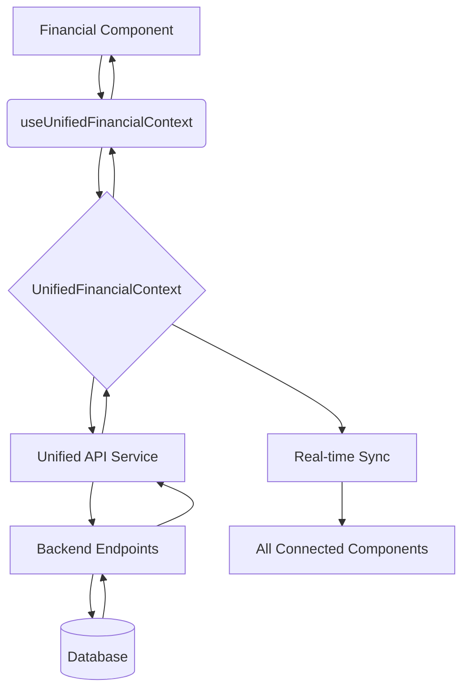
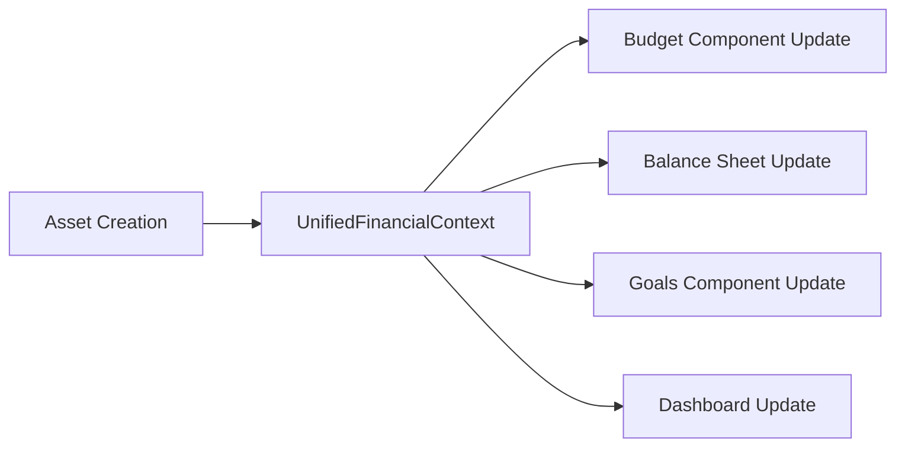

# Technical Development Guide (v2.0)

## 1. Overview

This document provides technical standards and architectural guidelines for ongoing development of the personal finance application. It defines patterns, conventions, and implementation approaches that must be followed to maintain code quality and architectural integrity.

## 2. Core Architecture Principles

### 2.1. Single Source of Truth for Financial Data

To ensure data consistency and reliability, all financial data (including income, expenses, assets, liabilities, and goals) must be managed by a single, centralized data management system. This system is the **single source of truth** for all financial data in the application.

*   **DO NOT** create separate data stores for different features.
*   **DO NOT** make direct API calls to financial data endpoints from UI components.
*   **DO** use the provided `useFinancialData` hook to access and manipulate all financial data.

### 2.2. Clean Architecture Compliance

All new code must follow clean architecture principles:

*   **Dependency Inversion**: Inner layers never depend on outer layers.
*   **Single Responsibility**: Each class/module has one reason to change.
*   **Interface Segregation**: Clients depend only on interfaces they use.
*   **Domain Isolation**: Business logic is framework-agnostic.

### 2.3. UnifiedFinancialContext Architecture

**IMPLEMENTATION STANDARD**: All financial components must use the UnifiedFinancialContext as the single source of truth for financial data management.

#### 2.3.1. Context Structure Requirements
```typescript
interface UnifiedFinancialState {
  // Core Financial Entities
  assets: Asset[];
  liabilities: Liability[];
  income: IncomeSource[];
  expenses: Expense[];
  transactions: Transaction[];
  goals: Goal[];
  budgetCategories: BudgetCategory[];
  
  // Calculated Financial Metrics
  netWorth: NetWorthData | null;
  cashFlow: CashFlowData | null;
  goalProgress: GoalProgressData | null;
  budgetStatus: BudgetStatusData | null;
  
  // State Management
  loading: LoadingState;
  errors: ErrorState;
}
```

#### 2.3.2. Component Integration Requirements
- **MANDATORY**: All financial components must consume data through `useUnifiedFinancialContext()`
- **PROHIBITED**: Direct API calls (`fetch()`) to financial endpoints from components
- **REQUIRED**: Real-time cross-component synchronization within 2 seconds

#### 2.3.3. API Integration Pattern
```typescript
// CORRECT: Context-managed API calls
const { createAsset, assets, loading } = useUnifiedFinancialContext();

// INCORRECT: Direct API calls in components
const response = await fetch('/api/v1/assets-v2/');
```

### 2.4. Zero Hardcoded Values Policy

**CRITICAL**: The system must never contain hardcoded business data or calculations. All values must be:

*   Stored in the database.
*   Retrieved via APIs.
*   Calculated dynamically.
*   Configurable.

## 3. Data Flow and Management

### 3.1. Unified Financial Context Data Flow

The following diagram illustrates the data flow through UnifiedFinancialContext:



### 3.2. Cross-Component Synchronization Flow



### 3.3. How to Add a New Financial Feature

1.  **Backend:**
    1.  Create a new API endpoint following `/api/v1/{resource}-v2/` pattern.
    2.  The endpoint should interact with the appropriate backend service to access the database.
2.  **Frontend:**
    1.  Update the `UnifiedFinancialContext` to include the new data entity.
    2.  Add API integration method to the unified API service.
    3.  Add new action methods to the context (create, update, delete operations).
    4.  Create UI component that **must** use `useUnifiedFinancialContext()` hook.
    5.  **PROHIBITED**: Direct API calls from components.

### 3.4. Component Migration Pattern

When migrating existing components to UnifiedFinancialContext:

```typescript
// BEFORE: Direct API call pattern
const [assets, setAssets] = useState([]);
useEffect(() => {
  const fetchAssets = async () => {
    const token = localStorage.getItem('accessToken');
    const response = await fetch('/api/v1/assets-v2/', {
      headers: { 'Authorization': `Bearer ${token}` }
    });
    const data = await response.json();
    setAssets(data);
  };
  fetchAssets();
}, []);

// AFTER: Unified context pattern
const { assets, createAsset, loading, error } = useUnifiedFinancialContext();
```

### 3.3. Definition of Done for Features

A feature is considered "done" when it meets the following criteria:

*   The feature is integrated with the centralized data management system (`FinancialDataContext`).
*   The feature is covered by end-to-end tests that verify its integration with other features.
*   The feature has been reviewed and approved by at least one other developer.
*   The feature has been tested against the user's specific use cases.

## 4. Frontend Architecture Standards

### 4.1. Component Structure

```
src/
├── contexts/             # UnifiedFinancialContext and other React Contexts
├── hooks/                # Custom hooks (useUnifiedFinancialContext)
├── components/           # UI components
│   ├── shared/           # Shared components (Button, Input, Select)
│   ├── assets/           # Asset management components
│   ├── budget/           # Budget and cashflow components
│   ├── balance-sheet/    # Balance sheet and net worth components
│   ├── dashboard/        # Financial dashboard components
│   ├── expenses/         # Expense management components
│   ├── goals/            # Goals management components
│   ├── tools/            # Financial tools components
│   └── ui/               # Base UI components
└── services/             # API services and utilities
```

### 4.2. UI Component Validation Rules

#### 4.2.1. Select Component Standards
**CRITICAL**: Custom Select components must not contain nested div structures in SelectContent.

```typescript
// ❌ INCORRECT: Invalid nested div structure
<SelectContent>
  <div className="grid grid-cols-1 gap-2">
    <SelectItem value="real_estate">Real Estate</SelectItem>
  </div>
</SelectContent>

// ✅ CORRECT: Direct SelectItem usage or native HTML
<SelectContent>
  <SelectItem value="real_estate">Real Estate</SelectItem>
  <SelectItem value="vehicle">Vehicle</SelectItem>
</SelectContent>

// ✅ ALTERNATIVE: Native HTML select for simple cases
<select className="form-select">
  <optgroup label="Property">
    <option value="real_estate">Real Estate</option>
  </optgroup>
</select>
```

#### 4.2.2. Form Validation Requirements
- **Required**: Real-time validation with immediate feedback
- **Required**: Accessible error messages with `aria-describedby`
- **Required**: Proper labeling with `htmlFor` attributes
- **Required**: Keyboard navigation support

#### 4.2.3. Financial Component Standards
- **MANDATORY**: Use `useUnifiedFinancialContext()` for all financial data
- **PROHIBITED**: Component-level state for financial data
- **REQUIRED**: Loading states during data operations
- **REQUIRED**: Error handling with user-friendly messages

### 4.3. State Management Architecture

*   **Financial Data**: Use `UnifiedFinancialContext` exclusively
*   **UI State**: Component-level state for UI-related state only (modals, form validation, etc.)
*   **Cross-Component**: Context for shared UI state (theme, navigation)

### 4.4. Component Performance Standards

*   **Re-render Optimization**: Use `useMemo` and `useCallback` for context consumers
*   **Selective Updates**: Components should re-render only when relevant data changes
*   **Loading States**: Show loading indicators during data fetches (max 3 seconds)
*   **Error Boundaries**: Implement error boundaries for component failure isolation

## 5. Backend Architecture Standards

The backend should follow the clean architecture principles outlined in section 2.2.

## 6. Testing Standards

### 6.1. Test Coverage

*   **Unit Tests:** 90%
*   **Integration Tests:** 80%
*   **End-to-End Tests:** 70%

### 6.2. Testing Strategy

*   **Unit Tests:** Test individual components and functions in isolation.
*   **Integration Tests:** Test the interaction between different parts of the system (e.g., the UI and the API).
*   **End-to-End Tests:** Test the complete user flow for a feature.

## 7. Security Standards

*   All sensitive financial data must be encrypted at rest and in transit.
*   All API endpoints must be authenticated and authorized.
*   All user input must be validated.

## 8. Performance Standards

*   **API Response Time:** < 200ms
*   **Page Load Time:** < 2s