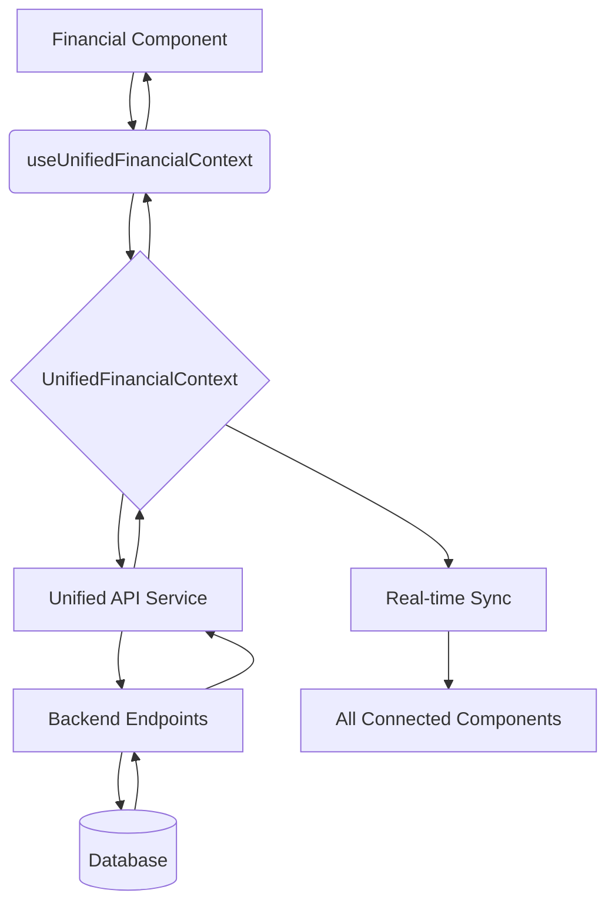
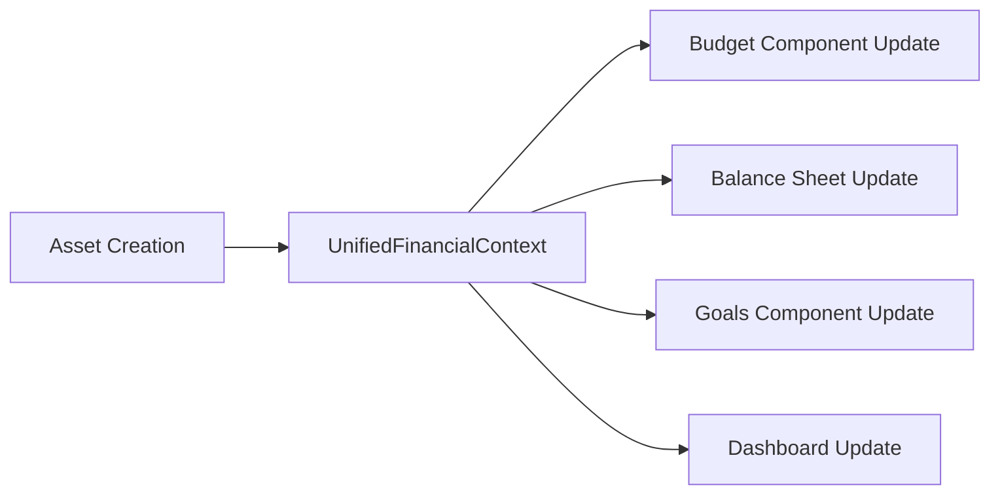

# Technical Development Guide (v2.0)

## 1. Overview

This document provides technical standards and architectural guidelines for ongoing development of the personal finance application. It defines patterns, conventions, and implementation approaches that must be followed to maintain code quality and architectural integrity.

## 2. Core Architecture Principles

### 2.1. Single Source of Truth for Financial Data

To ensure data consistency and reliability, all financial data (including income, expenses, assets, liabilities, and goals) must be managed by a single, centralized data management system. This system is the **single source of truth** for all financial data in the application.

*   **DO NOT** create separate data stores for different features.
*   **DO NOT** make direct API calls to financial data endpoints from UI components.
*   **DO** use the provided `useFinancialData` hook to access and manipulate all financial data.

### 2.2. Clean Architecture Compliance

All new code must follow clean architecture principles:

*   **Dependency Inversion**: Inner layers never depend on outer layers.
*   **Single Responsibility**: Each class/module has one reason to change.
*   **Interface Segregation**: Clients depend only on interfaces they use.
*   **Domain Isolation**: Business logic is framework-agnostic.

### 2.3. UnifiedFinancialContext Architecture

**IMPLEMENTATION STANDARD**: All financial components must use the UnifiedFinancialContext as the single source of truth for financial data management.

#### 2.3.1. Context Structure Requirements
```typescript
interface UnifiedFinancialState {
  // Core Financial Entities
  assets: Asset[];
  liabilities: Liability[];
  income: IncomeSource[];
  expenses: Expense[];
  transactions: Transaction[];
  goals: Goal[];
  budgetCategories: BudgetCategory[];
  
  // Calculated Financial Metrics
  netWorth: NetWorthData | null;
  cashFlow: CashFlowData | null;
  goalProgress: GoalProgressData | null;
  budgetStatus: BudgetStatusData | null;
  
  // State Management
  loading: LoadingState;
  errors: ErrorState;
}
```

#### 2.3.2. Component Integration Requirements
- **MANDATORY**: All financial components must consume data through `useUnifiedFinancialContext()`
- **PROHIBITED**: Direct API calls (`fetch()`) to financial endpoints from components
- **REQUIRED**: Real-time cross-component synchronization within 2 seconds
- **CRITICAL**: Complete CRUD operations support for all financial entities

#### 2.3.3. CRUD Operations Standard
**REQUIREMENT**: Every financial entity MUST support full Create, Read, Update, Delete operations

**Implementation Requirements:**
```typescript
// MANDATORY: Every financial entity context method pattern
interface EntityCRUDOperations<T> {
  // Create
  create: (data: CreateEntityData) => Promise<T>;
  
  // Read
  getAll: () => T[];
  getById: (id: string) => T | null;
  
  // Update  
  update: (id: string, data: UpdateEntityData) => Promise<T>;
  
  // Delete
  delete: (id: string) => Promise<void>;
}
```

**Context Integration:**
- All CRUD operations must trigger cross-component synchronization
- Update/Delete operations must validate dependencies before execution
- Error handling must preserve data integrity across all operations

#### 2.3.3. API Integration Pattern
```typescript
// CORRECT: Context-managed API calls
const { createAsset, assets, loading } = useUnifiedFinancialContext();

// INCORRECT: Direct API calls in components
const response = await fetch('/api/v1/assets-v2/');
```

### 2.4. Zero Hardcoded Values Policy

**CRITICAL**: The system must never contain hardcoded business data or calculations. All values must be:

*   Stored in the database.
*   Retrieved via APIs.
*   Calculated dynamically.
*   Configurable.

## 3. Data Flow and Management

### 3.1. Unified Financial Context Data Flow

The following diagram illustrates the data flow through UnifiedFinancialContext:



### 3.2. Cross-Component Synchronization Flow



### 3.3. Standard Change Request Process

**MANDATORY**: All financial component changes must follow this structured process:

#### **Step 1: Change Request Creation**
- **Problem Statement**: Clear description of current issues and business impact
- **Scope Definition**: In-scope vs out-of-scope items clearly defined
- **User Impact Assessment**: Primary and secondary users affected
- **Dependencies Mapping**: Hard dependencies (blocking) and soft dependencies (coordinating)
- **Risk Analysis**: High/Medium/Low risks with mitigation strategies
- **Acceptance Criteria**: Functional, technical, and performance requirements
- **Rollback Strategy**: Component-level, batch-level, and full rollback procedures

#### **Step 2: Affected Sections Mapping**
- **Code Modules**: All files requiring changes with before/after status
- **Tests**: Unit, integration, and E2E test updates required
- **Configuration**: App.jsx, imports, provider setup changes
- **Documentation**: Component docs, API docs, architecture updates
- **Dependencies & Side Effects**: Context mergers, API call removals, state management changes

#### **Step 3: Implementation Plan**
- **Tasks & Order**: Phased approach with specific tasks and dependencies
- **Branch Strategy**: Feature branches, component branches, integration branches
- **Data Migration**: No-downtime migration approach for financial data
- **Security Notes**: Authentication, data validation, error handling considerations
- **Performance Notes**: Optimization strategies, benchmarking requirements
- **Test Plan**: Unit, integration, E2E, and regression testing strategies

#### **Step 4: Agent Review Process**
- **Self-Checklist**: Component mapping, migration patterns, rollback testing
- **Static Checks**: TypeScript validation, ESLint compliance, import consistency
- **Feasibility Check**: Context support, API compatibility, performance impact, timeline assessment

#### **Step 5: Implementation Execution**
- **Small Commits**: Each component or batch in separate atomic commits
- **Documentation Updates**: Update docs alongside code changes
- **Component Migration Pattern**: Standardized before/after transformation approach

#### **Step 6: Validation Process**
- **Test Updates**: Add/update unit tests for each migrated component
- **Integration Testing**: Cross-component synchronization validation
- **Acceptance Criteria**: Verify all functional, technical, performance requirements
- **Format Compliance**: Code formatting, linting, type checking

#### **Step 7: Review & Merge**
- **Pull Request**: Comprehensive summary with risks and test evidence
- **Peer Review**: Address all review comments before merge
- **Integration Validation**: Final validation in integration environment

#### **Step 8: Release & Monitoring**
- **Staged Deployment**: Local → Integration → Staging → Canary → Production
- **Feature Flags**: Gradual rollout with monitoring capabilities
- **Metrics Monitoring**: Performance, functionality, user experience indicators
- **Rollback Readiness**: Immediate rollback capability if issues detected

#### **Step 9: Closeout**
- **Documentation Updates**: Component usage, architecture, changelog updates
- **PR Linking**: All related pull requests and issues linked
- **Request Completion**: Mark change request as completed with outcomes

### 3.4. How to Add a New Financial Feature

1.  **Backend:**
    1.  Create a new API endpoint following `/api/v1/{resource}-v2/` pattern.
    2.  The endpoint should interact with the appropriate backend service to access the database.
2.  **Frontend:**
    1.  Update the `UnifiedFinancialContext` to include the new data entity.
    2.  Add API integration method to the unified API service.
    3.  Add new action methods to the context (create, update, delete operations).
    4.  Create UI component that **must** use `useUnifiedFinancialContext()` hook.
    5.  **PROHIBITED**: Direct API calls from components.

### 3.4. Component Migration Pattern

When migrating existing components to UnifiedFinancialContext:

```typescript
// BEFORE: Direct API call pattern
const [assets, setAssets] = useState([]);
useEffect(() => {
  const fetchAssets = async () => {
    const token = localStorage.getItem('accessToken');
    const response = await fetch('/api/v1/assets-v2/', {
      headers: { 'Authorization': `Bearer ${token}` }
    });
    const data = await response.json();
    setAssets(data);
  };
  fetchAssets();
}, []);

// AFTER: Unified context pattern
const { assets, createAsset, loading, error } = useUnifiedFinancialContext();
```

### 3.3. Definition of Done for Features

A feature is considered "done" when it meets the following criteria:

*   The feature is integrated with the centralized data management system (`FinancialDataContext`).
*   The feature is covered by end-to-end tests that verify its integration with other features.
*   The feature has been reviewed and approved by at least one other developer.
*   The feature has been tested against the user's specific use cases.

## 4. Frontend Architecture Standards

### 4.1. Component Structure

```
src/
├── contexts/             # UnifiedFinancialContext and other React Contexts
├── hooks/                # Custom hooks (useUnifiedFinancialContext)
├── components/           # UI components
│   ├── shared/           # Shared components (Button, Input, Select)
│   ├── assets/           # Asset management components
│   ├── budget/           # Budget and cashflow components
│   ├── balance-sheet/    # Balance sheet and net worth components
│   ├── dashboard/        # Financial dashboard components
│   ├── expenses/         # Expense management components
│   ├── goals/            # Goals management components
│   ├── tools/            # Financial tools components
│   └── ui/               # Base UI components
└── services/             # API services and utilities
```

### 4.2. Enterprise UI/UX Design Standards

#### 4.2.1. Professional Design System

**Color Palette - Enterprise Financial Standards:**
```typescript
// Primary Brand Colors
const ENTERPRISE_COLORS = {
  primary: {
    50: '#f0f9ff',   // Light blue backgrounds
    100: '#e0f2fe',  // Subtle highlights
    500: '#0ea5e9',  // Primary actions
    600: '#0284c7',  // Primary hover
    700: '#0369a1',  // Primary active
    900: '#0c4a6e'   // Dark text
  },
  financial: {
    positive: '#059669',  // Gains, positive performance
    negative: '#dc2626',  // Losses, negative performance
    neutral: '#6b7280',   // Neutral data
    warning: '#d97706',   // Caution, moderate risk
    success: '#16a34a',   // Goals achieved
    info: '#2563eb'       // Information, benchmarks
  },
  risk: {
    conservative: '#10b981', // Low risk
    moderate: '#f59e0b',     // Medium risk
    aggressive: '#ef4444'    // High risk
  }
};
```

**Typography Hierarchy:**
```css
/* Executive Dashboard Typography */
.text-display-xl { font-size: 3rem; line-height: 3.5rem; font-weight: 700; } /* Key metrics */
.text-display-lg { font-size: 2.5rem; line-height: 3rem; font-weight: 600; }   /* Section headers */
.text-heading-xl { font-size: 2rem; line-height: 2.5rem; font-weight: 600; }   /* Card titles */
.text-heading-lg { font-size: 1.5rem; line-height: 2rem; font-weight: 600; }   /* Subsections */
.text-body-lg { font-size: 1.125rem; line-height: 1.75rem; font-weight: 400; } /* Primary text */
.text-body-md { font-size: 1rem; line-height: 1.5rem; font-weight: 400; }      /* Standard text */
.text-caption { font-size: 0.875rem; line-height: 1.25rem; font-weight: 400; } /* Metadata */
.text-micro { font-size: 0.75rem; line-height: 1rem; font-weight: 400; }       /* Footnotes */
```

#### 4.2.2. Financial Data Presentation Standards

**Currency Formatting Requirements:**
```typescript
// REQUIRED: Consistent currency formatting
const formatCurrency = (amount: number, options = {}) => {
  return new Intl.NumberFormat('en-KE', {
    style: 'currency',
    currency: 'KES',
    minimumFractionDigits: 2,
    maximumFractionDigits: 2,
    ...options
  }).format(amount);
};

// Percentage formatting with precision control
const formatPercentage = (value: number, precision = 2) => {
  return `${(value * 100).toFixed(precision)}%`;
};

// Large number formatting with K/M/B suffixes
const formatLargeNumber = (num: number) => {
  if (num >= 1e9) return `${(num / 1e9).toFixed(1)}B`;
  if (num >= 1e6) return `${(num / 1e6).toFixed(1)}M`;
  if (num >= 1e3) return `${(num / 1e3).toFixed(1)}K`;
  return num.toLocaleString();
};
```

**Performance Indicators:**
```typescript
// MANDATORY: Consistent performance indicators
interface PerformanceIndicator {
  value: number;
  change: number;
  period: string;
  trend: 'positive' | 'negative' | 'neutral';
}

const PerformanceCard = ({ metric }: { metric: PerformanceIndicator }) => (
  <Card>
    <CardContent className="p-6">
      <div className="flex items-center justify-between">
        <span className="text-caption text-gray-600">{metric.period}</span>
        <TrendIcon trend={metric.trend} />
      </div>
      <div className="mt-2">
        <span className="text-display-lg font-bold">{formatCurrency(metric.value)}</span>
        <span className={`ml-2 text-body-md ${
          metric.trend === 'positive' ? 'text-financial-positive' : 
          metric.trend === 'negative' ? 'text-financial-negative' : 'text-gray-600'
        }`}>
          {formatPercentage(metric.change, 1)}
        </span>
      </div>
    </CardContent>
  </Card>
);
```

#### 4.2.3. Select Component Standards
**CRITICAL**: Custom Select components must not contain nested div structures in SelectContent.

```typescript
// ❌ INCORRECT: Invalid nested div structure
<SelectContent>
  <div className="grid grid-cols-1 gap-2">
    <SelectItem value="real_estate">Real Estate</SelectItem>
  </div>
</SelectContent>

// ✅ CORRECT: Direct SelectItem usage with enterprise styling
<SelectContent className="bg-white border border-gray-200 shadow-lg rounded-md">
  <SelectItem value="real_estate" className="hover:bg-blue-50 focus:bg-blue-50">
    Real Estate
  </SelectItem>
  <SelectItem value="vehicle" className="hover:bg-blue-50 focus:bg-blue-50">
    Vehicle
  </SelectItem>
</SelectContent>
```

#### 4.2.4. Form Validation Requirements - Enterprise Grade
- **Required**: Real-time validation with immediate feedback within 300ms
- **Required**: Accessible error messages with `aria-describedby` and `role="alert"`
- **Required**: Proper labeling with `htmlFor` attributes and required indicators
- **Required**: Keyboard navigation support with logical tab order
- **Required**: Error state persistence until resolved
- **Required**: Success confirmation states for completed actions

**Enterprise Form Validation Pattern:**
```typescript
const FormField = ({ 
  label, 
  error, 
  required = false, 
  value, 
  onChange, 
  type = 'text',
  ...props 
}) => (
  <div className="space-y-2">
    <Label htmlFor={props.id} className="text-body-md font-medium text-gray-900">
      {label}
      {required && <span className="text-red-500 ml-1" aria-label="required">*</span>}
    </Label>
    <Input
      {...props}
      value={value}
      onChange={onChange}
      type={type}
      aria-invalid={!!error}
      aria-describedby={error ? `${props.id}-error` : undefined}
      className={`${error ? 'border-red-500 focus:ring-red-500' : 'border-gray-300 focus:ring-blue-500'}`}
    />
    {error && (
      <p 
        id={`${props.id}-error`} 
        role="alert" 
        className="text-sm text-red-600 flex items-center"
      >
        <AlertCircle className="w-4 h-4 mr-1" />
        {error}
      </p>
    )}
  </div>
);
```

#### 4.2.5. Financial Component Standards - CFA Aligned
- **MANDATORY**: Use `useUnifiedFinancialContext()` for all financial data
- **PROHIBITED**: Component-level state for financial data
- **REQUIRED**: Loading states during data operations with skeleton screens
- **REQUIRED**: Error handling with user-friendly messages and recovery actions
- **REQUIRED**: Calculation transparency with expandable methodology sections
- **REQUIRED**: Source attribution for all financial data and calculations

**CFA-Compliant Financial Display:**
```typescript
const FinancialMetric = ({ 
  value, 
  label, 
  calculation, 
  source, 
  confidenceLevel, 
  methodology 
}) => (
  <Card className="border border-gray-200">
    <CardHeader>
      <CardTitle className="text-heading-lg">{label}</CardTitle>
    </CardHeader>
    <CardContent>
      <div className="text-display-xl font-bold text-gray-900 mb-2">
        {formatCurrency(value)}
      </div>
      {confidenceLevel && (
        <div className="text-caption text-gray-600 mb-3">
          Confidence Level: {formatPercentage(confidenceLevel)}
        </div>
      )}
      <details className="mt-4">
        <summary className="text-body-md font-medium text-blue-600 cursor-pointer hover:text-blue-800">
          Show Calculation
        </summary>
        <div className="mt-2 p-3 bg-gray-50 rounded-md">
          <pre className="text-sm text-gray-700">{calculation}</pre>
          {methodology && (
            <div className="mt-2 text-caption text-gray-600">
              <strong>Methodology:</strong> {methodology}
            </div>
          )}
          {source && (
            <div className="mt-1 text-micro text-gray-500">
              Source: {source}
            </div>
          )}
        </div>
      </details>
    </CardContent>
  </Card>
);
```

#### 4.2.6. Data Visualization Standards - CFA Compliant

**Chart Color Schemes:**
```typescript
// Risk-adjusted color schemes for financial data visualization
const CHART_COLORS = {
  performance: {
    outperform: '#16a34a',    // Green for above-benchmark
    underperform: '#dc2626',  // Red for below-benchmark
    benchmark: '#6b7280'      // Gray for benchmark line
  },
  allocation: [
    '#0ea5e9', '#8b5cf6', '#f59e0b', '#10b981', 
    '#ef4444', '#84cc16', '#f97316', '#06b6d4'
  ],
  riskReturn: {
    conservative: '#10b981',  // Green
    moderate: '#f59e0b',      // Amber  
    aggressive: '#ef4444'     // Red
  }
};

// MANDATORY: Chart configuration standards
interface ChartConfig {
  responsive: true;
  maintainAspectRatio: boolean;
  accessibility: {
    enabled: true;
    description: string;
    keyboardNavigation: true;
  };
  tooltip: {
    enabled: true;
    format: (value: number) => string;
  };
}
```

**Portfolio Visualization Requirements:**
```typescript
// Asset Allocation Pie Chart - Maximum 8 segments
const AssetAllocationChart = ({ allocations }) => {
  const processedData = allocations.length > 8 
    ? [...allocations.slice(0, 7), { name: 'Others', value: allocations.slice(7).reduce((sum, item) => sum + item.value, 0) }]
    : allocations;
    
  return (
    <PieChart data={processedData} colors={CHART_COLORS.allocation}>
      <Tooltip formatter={(value) => formatPercentage(value / 100)} />
      <Legend position="right" />
    </PieChart>
  );
};

// Performance Trend Line Chart
const PerformanceTrendChart = ({ data, benchmark }) => (
  <LineChart data={data}>
    <Line dataKey="portfolio" stroke={CHART_COLORS.performance.outperform} strokeWidth={2} />
    <Line dataKey="benchmark" stroke={CHART_COLORS.performance.benchmark} strokeWidth={1} strokeDasharray="5,5" />
    <XAxis dataKey="date" />
    <YAxis tickFormatter={(value) => formatPercentage(value)} />
    <Tooltip 
      formatter={(value, name) => [formatPercentage(value), name]}
      labelFormatter={(date) => new Date(date).toLocaleDateString()}
    />
  </LineChart>
);
```

#### 4.2.7. Accessibility Standards - WCAG 2.1 AA Compliance

**Keyboard Navigation Requirements:**
```typescript
// REQUIRED: Logical tab order and keyboard shortcuts
const KeyboardNavigationStandards = {
  tabOrder: 'sequential', // Follow visual layout
  skipLinks: true,        // "Skip to main content" links
  focusManagement: {
    visibleIndicator: '2px solid #0ea5e9', // Blue focus ring
    trapFocus: true,      // Modal/dialog focus trapping
    returnFocus: true     // Return focus after modal close
  },
  shortcuts: {
    'Alt + H': 'Navigate to home/dashboard',
    'Alt + S': 'Search functionality',
    'Alt + N': 'Create new item',
    'Escape': 'Close modal/dropdown'
  }
};
```

**Screen Reader Optimization:**
```typescript
// MANDATORY: ARIA labels and descriptions for financial data
const AccessibleFinancialDisplay = ({ value, label, trend, description }) => (
  <div 
    role="img" 
    aria-label={`${label}: ${formatCurrency(value)} with ${trend} trend`}
    aria-describedby={`${label.toLowerCase().replace(' ', '-')}-description`}
  >
    <span className="text-display-lg font-bold">{formatCurrency(value)}</span>
    <TrendIcon 
      trend={trend} 
      aria-label={`Performance trending ${trend}`}
    />
    <div 
      id={`${label.toLowerCase().replace(' ', '-')}-description`} 
      className="sr-only"
    >
      {description}
    </div>
  </div>
);
```

**Color Independence Standards:**
```typescript
// REQUIRED: Information conveyed through multiple channels
const StatusIndicator = ({ status, value }) => {
  const getStatusDisplay = (status) => {
    switch(status) {
      case 'positive':
        return { color: 'text-green-600', icon: '↗', symbol: '+' };
      case 'negative':
        return { color: 'text-red-600', icon: '↘', symbol: '-' };
      default:
        return { color: 'text-gray-600', icon: '→', symbol: '=' };
    }
  };
  
  const { color, icon, symbol } = getStatusDisplay(status);
  
  return (
    <span className={`${color} flex items-center`}>
      <span aria-hidden="true" className="mr-1">{icon}</span>
      <span className="font-medium">{symbol}{formatPercentage(Math.abs(value))}</span>
      <span className="sr-only">
        {status === 'positive' ? 'increase' : status === 'negative' ? 'decrease' : 'no change'}
      </span>
    </span>
  );
};
```

#### 4.2.8. Responsive Design Standards

**Breakpoint System:**
```css
/* Mobile-first responsive breakpoints */
@media (min-width: 640px)  { /* sm: tablet portrait */ }
@media (min-width: 768px)  { /* md: tablet landscape */ }
@media (min-width: 1024px) { /* lg: desktop */ }
@media (min-width: 1280px) { /* xl: large desktop */ }
@media (min-width: 1536px) { /* 2xl: ultra-wide */ }
```

**Dashboard Layout Patterns:**
```typescript
// REQUIRED: Responsive dashboard grid
const ResponsiveDashboard = ({ widgets }) => (
  <div className="grid grid-cols-1 md:grid-cols-2 lg:grid-cols-3 xl:grid-cols-4 gap-6 p-6">
    {widgets.map((widget, index) => (
      <div 
        key={widget.id}
        className={`
          ${widget.size === 'large' ? 'col-span-full lg:col-span-2' : ''}
          ${widget.size === 'wide' ? 'col-span-full md:col-span-2' : ''}
        `}
      >
        {widget.component}
      </div>
    ))}
  </div>
);
```

#### 4.2.9. Enterprise Workflow Patterns

**Progressive Disclosure Pattern:**
```typescript
// Multi-step financial process (Goal Creation, Asset Onboarding)
const MultiStepWorkflow = ({ steps, currentStep, onStepChange }) => (
  <div className="max-w-4xl mx-auto">
    {/* Progress Indicator */}
    <nav aria-label="Progress" className="mb-8">
      <ol className="flex items-center">
        {steps.map((step, index) => (
          <li key={step.id} className={`${index !== steps.length - 1 ? 'flex-1' : ''}`}>
            <div className={`flex items-center ${
              index < currentStep ? 'text-blue-600' : 
              index === currentStep ? 'text-blue-600' : 'text-gray-400'
            }`}>
              <span className={`
                flex h-10 w-10 items-center justify-center rounded-full border-2
                ${index < currentStep ? 'bg-blue-600 border-blue-600 text-white' :
                  index === currentStep ? 'border-blue-600' : 'border-gray-300'}
              `}>
                {index < currentStep ? '✓' : index + 1}
              </span>
              <span className="ml-4 text-sm font-medium">{step.title}</span>
            </div>
            {index !== steps.length - 1 && (
              <div className={`ml-4 mt-0.5 h-0.5 w-full ${
                index < currentStep ? 'bg-blue-600' : 'bg-gray-300'
              }`} />
            )}
          </li>
        ))}
      </ol>
    </nav>
    
    {/* Step Content */}
    <Card>
      <CardHeader>
        <CardTitle>{steps[currentStep].title}</CardTitle>
      </CardHeader>
      <CardContent>
        {steps[currentStep].component}
      </CardContent>
    </Card>
  </div>
);
```

**Error Boundary Pattern for Financial Components:**
```typescript
// REQUIRED: Graceful error handling for financial calculations
class FinancialErrorBoundary extends React.Component {
  constructor(props) {
    super(props);
    this.state = { hasError: false, error: null };
  }

  static getDerivedStateFromError(error) {
    return { hasError: true, error };
  }

  componentDidCatch(error, errorInfo) {
    console.error('Financial component error:', error, errorInfo);
    // Log to monitoring service
  }

  render() {
    if (this.state.hasError) {
      return (
        <Card className="border-red-200 bg-red-50">
          <CardContent className="p-6">
            <div className="flex items-center">
              <AlertCircle className="h-5 w-5 text-red-500 mr-2" />
              <h3 className="text-lg font-medium text-red-800">
                Unable to load financial data
              </h3>
            </div>
            <p className="mt-2 text-red-700">
              There was an error processing your financial information. 
              Please refresh the page or contact support if the problem persists.
            </p>
            <Button 
              variant="outline" 
              className="mt-4"
              onClick={() => window.location.reload()}
            >
              Refresh Page
            </Button>
          </CardContent>
        </Card>
      );
    }

    return this.props.children;
  }
}
```

### 4.3. State Management Architecture

*   **Financial Data**: Use `UnifiedFinancialContext` exclusively
*   **UI State**: Component-level state for UI-related state only (modals, form validation, etc.)
*   **Cross-Component**: Context for shared UI state (theme, navigation)

#### 4.2.10. Professional Reporting Interfaces

**Financial Report Layout Standards:**
```typescript
// REQUIRED: Professional financial report structure
const FinancialReport = ({ reportType, data, period, generatedDate }) => (
  <div className="max-w-5xl mx-auto bg-white">
    {/* Report Header */}
    <header className="border-b border-gray-200 pb-6 mb-8">
      <div className="flex justify-between items-start">
        <div>
          <h1 className="text-heading-xl font-bold text-gray-900">{reportType}</h1>
          <p className="text-body-md text-gray-600 mt-1">Period: {period}</p>
        </div>
        <div className="text-right">
          <div className="text-caption text-gray-500">Generated</div>
          <div className="text-body-md font-medium">{generatedDate}</div>
        </div>
      </div>
    </header>

    {/* Executive Summary */}
    <section className="mb-8">
      <h2 className="text-heading-lg font-semibold mb-4">Executive Summary</h2>
      <div className="grid grid-cols-1 md:grid-cols-3 gap-6">
        {data.keyMetrics.map((metric) => (
          <Card key={metric.label} className="p-4">
            <div className="text-caption text-gray-600 mb-1">{metric.label}</div>
            <div className="text-display-lg font-bold">{formatCurrency(metric.value)}</div>
            <div className="flex items-center mt-2">
              <StatusIndicator status={metric.trend} value={metric.change} />
              <span className="text-caption text-gray-500 ml-2">vs previous period</span>
            </div>
          </Card>
        ))}
      </div>
    </section>

    {/* Report Sections */}
    {data.sections.map((section) => (
      <section key={section.id} className="mb-8">
        <h2 className="text-heading-lg font-semibold mb-4">{section.title}</h2>
        {section.component}
      </section>
    ))}

    {/* Report Footer */}
    <footer className="border-t border-gray-200 pt-6 mt-8">
      <div className="text-micro text-gray-500">
        <p>This report is generated automatically based on your financial data.</p>
        <p>Data accuracy depends on the completeness of your financial information.</p>
        <p>© {new Date().getFullYear()} Personal Finance Application</p>
      </div>
    </footer>
  </div>
);
```

**Export and Print Optimization:**
```css
/* Print-specific styles for financial reports */
@media print {
  @page {
    margin: 1in;
    size: A4;
  }
  
  .no-print {
    display: none !important;
  }
  
  .print-break-before {
    page-break-before: always;
  }
  
  .print-break-inside-avoid {
    page-break-inside: avoid;
  }
  
  /* Optimize colors for print */
  .bg-blue-50 { background-color: #f8f9ff !important; }
  .text-blue-600 { color: #1e40af !important; }
  .border-blue-200 { border-color: #c3d9ff !important; }
}
```

#### 4.2.11. Loading States and Skeleton Screens

**Financial Data Loading Patterns:**
```typescript
// REQUIRED: Skeleton screens for financial data
const FinancialMetricSkeleton = () => (
  <Card>
    <CardContent className="p-6">
      <div className="animate-pulse">
        <div className="h-4 bg-gray-200 rounded w-1/2 mb-3"></div>
        <div className="h-8 bg-gray-200 rounded w-3/4 mb-2"></div>
        <div className="h-3 bg-gray-200 rounded w-1/3"></div>
      </div>
    </CardContent>
  </Card>
);

const ChartSkeleton = () => (
  <Card>
    <CardHeader>
      <div className="animate-pulse">
        <div className="h-6 bg-gray-200 rounded w-1/3 mb-2"></div>
        <div className="h-4 bg-gray-200 rounded w-1/2"></div>
      </div>
    </CardHeader>
    <CardContent>
      <div className="animate-pulse">
        <div className="h-64 bg-gray-200 rounded"></div>
      </div>
    </CardContent>
  </Card>
);

// Progressive loading with stages
const FinancialDashboard = () => {
  const [loadingStage, setLoadingStage] = useState('initializing');
  // Stages: 'initializing' -> 'fetching-data' -> 'calculating' -> 'complete'
  
  return (
    <div className="space-y-6">
      {loadingStage !== 'complete' && (
        <Card className="border-blue-200 bg-blue-50">
          <CardContent className="p-4">
            <div className="flex items-center">
              <div className="animate-spin rounded-full h-4 w-4 border-b-2 border-blue-600 mr-3"></div>
              <span className="text-body-md text-blue-800">
                {loadingStage === 'initializing' && 'Initializing dashboard...'}
                {loadingStage === 'fetching-data' && 'Loading your financial data...'}
                {loadingStage === 'calculating' && 'Calculating metrics and projections...'}
              </span>
            </div>
          </CardContent>
        </Card>
      )}
      
      <div className="grid grid-cols-1 md:grid-cols-2 lg:grid-cols-3 gap-6">
        {loadingStage === 'complete' ? (
          // Actual components
          <FinancialMetricCard />
        ) : (
          // Skeleton screens
          <FinancialMetricSkeleton />
        )}
      </div>
    </div>
  );
};
```

#### 4.2.12. Data Entry Efficiency Standards

**Smart Input Components:**
```typescript
// REQUIRED: Intelligent form inputs for financial data
const CurrencyInput = ({ value, onChange, label, ...props }) => {
  const [displayValue, setDisplayValue] = useState('');
  
  const handleChange = (e) => {
    const rawValue = e.target.value.replace(/[^\d.]/g, '');
    const numericValue = parseFloat(rawValue) || 0;
    
    setDisplayValue(formatCurrency(numericValue));
    onChange(numericValue);
  };
  
  return (
    <FormField
      {...props}
      label={label}
      value={displayValue}
      onChange={handleChange}
      placeholder="KES 0.00"
      inputMode="decimal"
    />
  );
};

const PercentageInput = ({ value, onChange, label, ...props }) => (
  <div className="relative">
    <FormField
      {...props}
      label={label}
      value={value}
      onChange={(e) => onChange(parseFloat(e.target.value) || 0)}
      type="number"
      min="0"
      max="100"
      step="0.01"
      className="pr-8"
    />
    <div className="absolute inset-y-0 right-0 flex items-center pr-3 pointer-events-none">
      <span className="text-gray-500 text-body-md">%</span>
    </div>
  </div>
);

// Bulk operation interface
const BulkActionToolbar = ({ selectedItems, onAction }) => {
  if (selectedItems.length === 0) return null;
  
  return (
    <div className="fixed bottom-4 left-1/2 transform -translate-x-1/2 bg-white shadow-lg rounded-lg border border-gray-200 p-4 flex items-center space-x-4">
      <span className="text-body-md font-medium">
        {selectedItems.length} items selected
      </span>
      <div className="flex space-x-2">
        <Button size="sm" onClick={() => onAction('edit')}>
          Edit
        </Button>
        <Button size="sm" variant="outline" onClick={() => onAction('export')}>
          Export
        </Button>
        <Button size="sm" variant="outline" onClick={() => onAction('delete')} className="text-red-600 hover:text-red-700">
          Delete
        </Button>
      </div>
    </div>
  );
};
```

### 4.3. State Management Architecture

*   **Financial Data**: Use `UnifiedFinancialContext` exclusively
*   **UI State**: Component-level state for UI-related state only (modals, form validation, etc.)
*   **Cross-Component**: Context for shared UI state (theme, navigation)

### 4.4. Component Performance Standards

*   **Re-render Optimization**: Use `useMemo` and `useCallback` for context consumers
*   **Selective Updates**: Components should re-render only when relevant data changes
*   **Loading States**: Show loading indicators during data fetches (max 3 seconds)
*   **Error Boundaries**: Implement error boundaries for component failure isolation
*   **Skeleton Screens**: Use skeleton loading states for better perceived performance
*   **Progressive Loading**: Break complex data loading into stages with user feedback
*   **Virtualization**: Implement virtual scrolling for lists with >100 items

## 5. Backend Architecture Standards

The backend should follow the clean architecture principles outlined in section 2.2.

## 6. Testing Standards

### 6.1. Test Coverage

*   **Unit Tests:** 90%
*   **Integration Tests:** 80%
*   **End-to-End Tests:** 70%

### 6.2. Testing Strategy

*   **Unit Tests:** Test individual components and functions in isolation.
*   **Integration Tests:** Test the interaction between different parts of the system (e.g., the UI and the API).
*   **End-to-End Tests:** Test the complete user flow for a feature.

## 7. Security Standards

*   All sensitive financial data must be encrypted at rest and in transit.
*   All API endpoints must be authenticated and authorized.
*   All user input must be validated.

## 8. Performance Standards

*   **API Response Time:** < 200ms
*   **Page Load Time:** < 2s